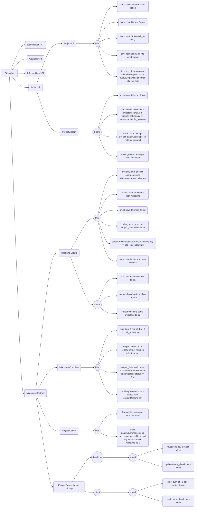

TODO: AIKEN ProjectInit Cancel && arbitraion offchain

TODO: AIKEN: must send usr_configNFT back to original address for (Talendro token, arbitrator nft minter)
TODO: PROJECTINIT Burn case shouldnot burn when no projectDatum input found with somecondition like pay:none or etc.
TODO: milestone project in holding contract

